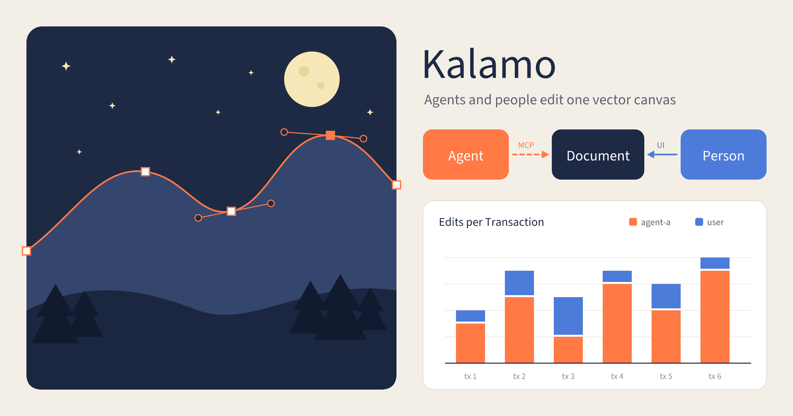

# Kalamo

A vector drawing tool that runs in the browser, built so AI agents can read and write the document through MCP while a person edits the same file in a normal Illustrator-style canvas.



An Agent drew this over MCP: Live Shapes, Bezier paths and text in two Layers, with each label centred from the bounds the server measured, then exported to PNG with `kalamo_export`.

Kalamo comes from Greek *kálamos*, the reed pen, the first drawing instrument. The same word means "pen" as Arabic *qalam*, Turkish *kalem* and Hindi *kalam*. Say it KAH-lah-moh; in Chinese it is 卡拉莫 (kǎ lā mò).

## Status

Milestone M0 is in progress (issue #1). A local Worker already takes MCP calls to create a Document, draw shapes into it, read its outline and render it to PNG. A browser viewer shows each Document live as an Agent draws, and a person can select, move and delete what it drew.

Start here. Domain vocabulary is in [CONTEXT.md](CONTEXT.md) and architecture decisions in [docs/adr/](docs/adr/).

| Document | Contents |
|---|---|
| [docs/REQUIREMENTS.md](docs/REQUIREMENTS.md) | Requirements v0.4 (Chinese). Scope, functional requirements, MCP tool surface, architecture, milestones, Illustrator feature mapping |
| [docs/research/01-illustrator-core-features.md](docs/research/01-illustrator-core-features.md) | Adobe Illustrator tools, panels, workflows and scripting DOM, from the official user guide |
| [docs/research/02-web-vector-tech-landscape.md](docs/research/02-web-vector-tech-landscape.md) | Figma, Penpot, Excalidraw, tldraw and Graphite architecture; rendering, boolean, text, freehand and sync library choices |
| [docs/research/03-mcp-design-tool-patterns.md](docs/research/03-mcp-design-tool-patterns.md) | How existing MCP servers expose design tools, and what breaks |

## Local development

Needs Node 22 or later.

```sh
corepack enable
pnpm install
pnpm check   # typecheck, Biome, and Vitest inside workerd
pnpm test:e2e # Playwright smoke test against its own wrangler dev (needs `pnpm exec playwright install chromium`)
pnpm dev     # builds the web app, then wrangler dev: viewer at http://localhost:8787, MCP at /mcp
```

Every MCP request needs `Authorization: Bearer <dev token>`. Copy `apps/edge/.dev.vars.example` to `apps/edge/.dev.vars` and set the `DEV_TOKENS` token-to-Agent-Actor pairs. Keep its `AUTH_MODE="dev"`: without it the Worker runs in GitHub mode and answers every request `server misconfigured` (see Hosting). Documents are stored under `.wrangler/state` and survive a restart of `pnpm dev`. The viewer lists them at http://localhost:8787 and opens one at `/docs/<docId>`: Space-drag or scroll to pan, Ctrl+scroll or pinch to zoom, Z then click (Alt+click) to zoom in (out), Ctrl+0 to fit the Artboards, Ctrl+1 for 100%. Click an object to select it (Shift-click toggles, Alt+Shift-click removes) or drag a marquee over several; drag the Selection to move it, press Delete or Backspace to delete it, Ctrl+A to select all and Ctrl+Shift+A to deselect. Each move or delete is one Transaction by the Actor `user`. Ctrl+Z undoes the Document's latest Transaction, whoever made it, including an Agent's whole Transaction in one step, and Ctrl+Shift+Z redoes it; both are Transactions too. The local viewer has no login (dev mode). The first `pnpm dev` asks once to apply the local D1 migration that indexes Documents.

To connect Claude Code, copy [examples/claude-code.mcp.json](examples/claude-code.mcp.json) to `.mcp.json`, or run:

```sh
claude mcp add --transport http kalamo http://localhost:8787/mcp -H "Authorization: Bearer YOUR_TOKEN"
```

The server is named `kalamo`, its tools are `kalamo_*` (`kalamo_doc_create`, `kalamo_export`, …), its resources `skill://kalamo/*`, and `kalamo_export` takes the format `kalamo_json`. In Claude Code, allow its tools with `mcp__kalamo__*`. A client set up before the product was renamed Kalamo (ADR-0069) must be added again under this name, and its permission allowlist and any tool names in prompts updated: the old names have no aliases.

## Hosting

The Worker runs in one of two auth modes, set by `AUTH_MODE` (ADR-0047):

- `github`, the default in `apps/edge/wrangler.jsonc`: people sign in to the browser app with GitHub. Any value other than `dev` means `github`.
- `dev`: MCP takes the `DEV_TOKENS` Bearer tokens and browsers are not signed in. GitHub mode ignores `DEV_TOKENS`. It is safe only on a private network, and only with long random tokens.

GitHub mode enforces the free beta's quotas, each failing `LIMIT_EXCEEDED` (ADR-0048): 50 owned Documents, 200 MB of image files per owner, 500 `render` and 200 `export` calls per User per UTC day, and 20 browser connections per Document. Dev mode enforces none of them.

GitHub mode needs a GitHub OAuth App (GitHub > Settings > Developer settings > OAuth Apps) whose authorization callback URL is `<APP_ORIGIN>/auth/github/callback`, for example `https://kalamo.example.workers.dev/auth/github/callback`. Kalamo asks it for no scopes. The Worker then needs these secrets, and answers every request 500 `server misconfigured` while one is missing:

- `APP_ORIGIN`: the browser app's origin, such as `https://kalamo.example.workers.dev`, with no trailing slash. It is also the OAuth issuer that MCP clients authorize with.
- `MCP_ORIGIN` (optional): the origin MCP clients connect to, such as `https://mcp.kalamo.example`, if it differs from `APP_ORIGIN`. Both hosts must route to the Worker.
- `GITHUB_CLIENT_ID` and `GITHUB_CLIENT_SECRET`: the OAuth App's.

GitHub mode also needs the `OAUTH_KV` KV namespace, where `@cloudflare/workers-oauth-provider` keeps MCP OAuth grants and tokens (hashed, with encrypted props). The provider needs no secret of its own.

MCP clients connect to `<MCP_ORIGIN>/mcp` with no token, for example `claude mcp add --transport http kalamo https://kalamo.example.workers.dev/mcp`. The client discovers the authorization server, opens GitHub sign-in and a Kalamo consent page in the browser, and becomes an Agent of that person, named after the client and the login. The account menu's Connected Agents lists and revokes them.

```sh
pnpm exec wrangler login
cp apps/edge/.deploy.vars.example apps/edge/.deploy.vars # fill in the secrets above
pnpm exec wrangler d1 create kalamo --location apac --binding DB --update-config -c apps/edge/wrangler.jsonc
pnpm exec wrangler kv namespace create kalamo-oauth --binding OAUTH_KV --update-config -c apps/edge/wrangler.jsonc
pnpm deploy:check
pnpm run deploy
```

`pnpm run deploy` (plain `pnpm deploy` is pnpm's own command) builds the web app, applies remote D1 migrations, uploads `apps/edge/.deploy.vars` as encrypted Worker secrets, and deploys the Worker, Durable Object, and static assets. It never reads `.dev.vars`, so a deployed Worker runs in GitHub mode unless the deploy sets `--var AUTH_MODE:dev` on purpose, as the hosted deployment below does until #173. The resulting `workers.dev` URL needs no domain configuration; add a custom domain later in Cloudflare if wanted, and update `APP_ORIGIN` and the OAuth App's callback URL to match.

### The hosted deployment

Kalamo is hosted at `https://kalamo.woodywang2013.workers.dev`: the app, `/mcp` and the API. Until GitHub sign-in is set up for it (#173), it runs in dev mode, and MCP takes the owner's `DEV_TOKENS`. Agent developers connect with:

```sh
claude mcp add --transport http kalamo https://kalamo.woodywang2013.workers.dev/mcp -H "Authorization: Bearer YOUR_TOKEN"
```

The deployment's former workers.dev URL redirects every request here, keeping the path, and a page load there brings the browser's open tabs and Pencil options along. To redeploy in dev mode, put only `DEV_TOKENS` in `apps/edge/.deploy.vars`, then run `pnpm deploy:check` and `pnpm run deploy --var AUTH_MODE:dev`, which overrides the config's `github`.

## What it is meant to do

Three kinds of work, all producing editable vector output rather than images:

- Charts and diagrams, from data or from a Mermaid description
- Illustration, icons and logos, with Bezier paths, boolean operations, gradients and an appearance stack
- Freehand drawing with pressure, fitted to editable curves

Agents drive it over MCP. Every edit a person can make in the UI has a matching tool call, and every write returns both the affected node IDs and an optional rendered preview, so an agent can check its own work.

## Planned shape

- Document model is a flat, ID-keyed scene graph serialised as readable JSON
- Rendering starts on Canvas2D and moves to Skia via CanvasKit as object counts grow
- Boolean operations use Skia PathOps; text is shaped with HarfBuzz
- Hosted on Cloudflare, with one Durable Object per document holding authoritative state; the same Worker bundle runs locally under `wrangler dev` and self-hosted under workerd
- MCP is stateless Streamable HTTP only: no stdio, no MCP sessions, every request carries its own token and document address
- Monorepo under `apps/` and `packages/`, laid out in REQUIREMENTS.md section 8.3

## Licence

Apache-2.0. See [LICENSE](LICENSE) and [NOTICE](NOTICE).

The Kalamo name and logo are not covered by that licence.
